  

    

<h2 align="center" style="color:ffffff;">👨 About Me</h2>

    

            I write Core Java with an obsession for correctness, clarity and performance.
            You'll find my fingerprints on <a href="https://github.com/quickfix-j/quickfixj">QuickFIX/J</a> (FIX protocol messaging), <a href="https://github.com/hazelcast/hazelcast">Hazelcast</a> (real-time data), <a href="https://github.com/dropwizard/dropwizard">Dropwizard Metrics</a> & <a href="https://github.com/micrometer-metrics/micrometer">Micrometer</a> (observability), and <a href="https://github.com/apache/mina">Apache MINA</a> (networking) and many more!
            Also a fan of retro tech, old-school algorithms, and the quirky corners of computing history.
    

    

<h2 align="center" style="color:ffffff;">💾 Projects</h2>

    

            A collection built from passion, curiosity, and constant experimentation.
            I like exploring ideas, trying unusual approaches, and learning by building.
    

    
    
     

